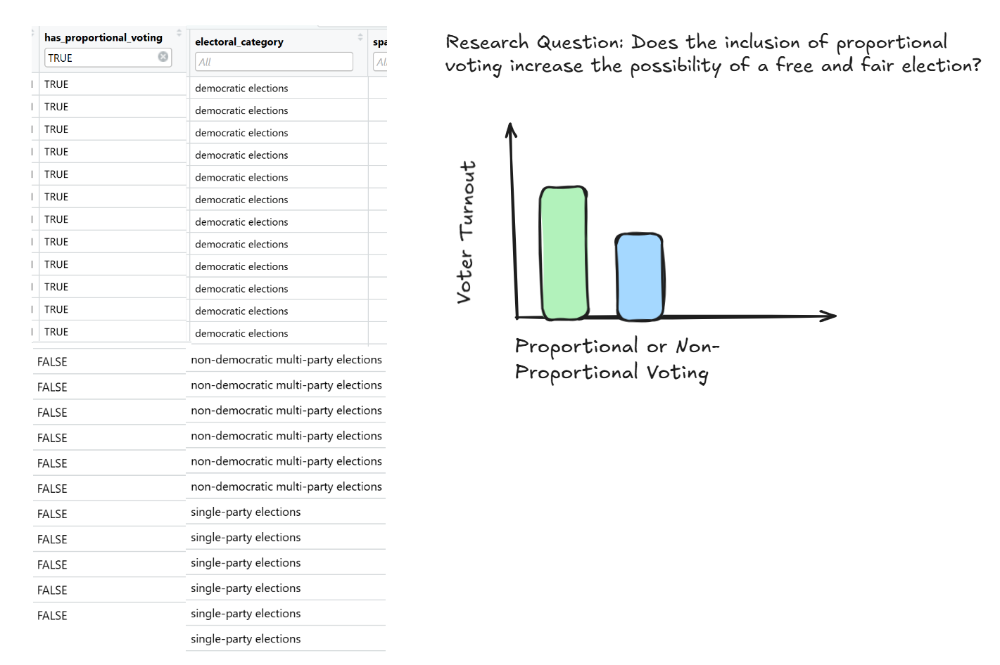
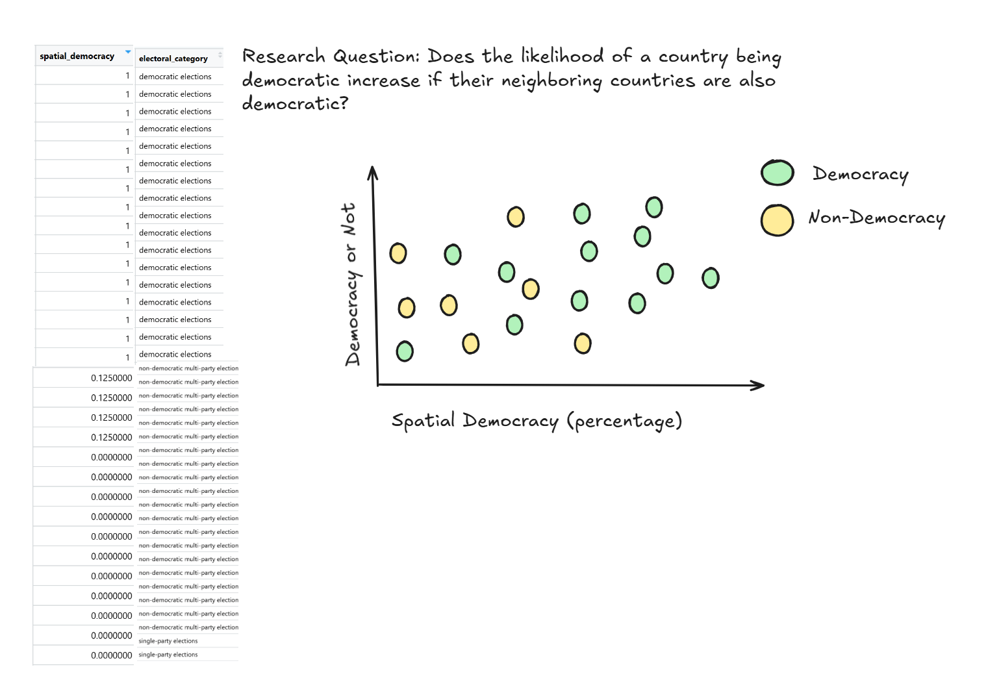

**Data: Geopolitical: Government Types**

This data set contains a list of world countries with the years and the type of regime the country had and the corresponding year. Additionally, aspects of the data is monarch name, monarch gender, free education and more.

```{r}
#| output: false
democracy_data <- readr::read_csv('https://raw.githubusercontent.com/rfordatascience/tidytuesday/main/data/2024/2024-11-05/democracy_data.csv')

```

**Data Cleaning**

The git repository for the geopolitical data set provides instructions for cleaning the data set. It utilized the "pak" package and the tidyverse to update the variable names to be more concise and readable.

Additionally is sets values that appear to have no value or it is missing to NA. It also sets the electoral category variable to be numbered 0 to 3 to indicate elections, number of party elections, democratic and more. Finally it changed the variables that end and or contain "\_index", "year", "\_members to be integer values and variables that start with "*is" and "has*" to be logical.

Below is the code used to accomplish this.

```{r}
#| output: false
  
library(democracyData)
library(dplyr)
library(tidyr)
library(stringr)
library(janitor)

democracy_data <-
  democracyData::pacl_update |>
  janitor::clean_names() |>
  dplyr::select(
    country_name = pacl_update_country,
    country_code = pacl_update_country_isocode,
    year,
    regime_category_index = dd_regime,
    regime_category = dd_category,
    is_monarchy = monarchy,
    is_commonwealth = commonwealth,
    monarch_name,
    monarch_accession_year = monarch_accession,
    monarch_birthyear,
    is_female_monarch = female_monarch,
    is_democracy = democracy,
    is_presidential = presidential,
    president_name,
    president_accesion_year = president_accesion,
    president_birthyear,
    is_interim_phase = interim_phase,
    is_female_president = female_president,
    is_colony = colony,
    colony_of,
    colony_administrated_by,
    is_communist = communist,
    has_regime_change_lag = regime_change_lag,
    spatial_democracy,
    parliament_chambers = no_of_chambers_in_parliament,
    has_proportional_voting = proportional_voting,
    election_system,
    lower_house_members = no_of_members_in_lower_house,
    upper_house_members = no_of_members_in_upper_house,
    third_house_members = no_of_members_in_third_house,
    has_new_constitution = new_constitution,
    has_full_suffrage = fullsuffrage,
    suffrage_restriction,
    electoral_category_index = electoral,
    spatial_electoral,
    has_alternation = alternation,
    is_multiparty = multiparty,
    has_free_and_fair_election = free_and_fair_election,
    parliamentary_election_year,
    election_month = election_month_year,
    has_postponed_election = postponed_election
  ) |>
  dplyr::mutate(
    election_month = dplyr::na_if(election_month, "?")
  ) |>
  tidyr::separate_wider_regex(
    election_month,
    patterns = c(
      election_month = "\\D+",
      election_year = "\\d{4}$"
    ),
    too_few = "align_start"
  ) |>
  dplyr::mutate(
    electoral_category = dplyr::case_match(
      electoral_category_index,
      0 ~ "no elections",
      1 ~ "single-party elections",
      2 ~ "non-democratic multi-party elections",
      3 ~ "democratic elections"
    ),
    .after = electoral_category_index
  ) |>
  dplyr::mutate(
    election_month = stringr::str_squish(election_month),
    dplyr::across(
      c(
        tidyselect::ends_with("_index"),
        tidyselect::contains("year"),
        tidyselect::ends_with("_members"),
        parliament_chambers
      ),
      as.integer
    ),
    dplyr::across(
      c(
        tidyselect::starts_with("is_"),
        tidyselect::starts_with("has_")
      ),
      as.logical
    )
  )
```

**Research Questions Based on Democracy Data:**

-   Does the inclusion of proportional voting increase the possibility of a free and fair election?

-   Does the likelihood of a country being democratic increase if their neighboring countries are also democratic?

**Research Questions Based on Supplemental Data:**

-   Do countries with stable economies tend to have more stable democracies over time?

-   Do literacy rates increase the likelihood that the country is democratic?

**Addressing Research Questions:**

Research Question: Does the inclusion of proportional voting increase the possibility of a free and fair election?

{width="584"}

Research Question: Does the likelihood of a country being democratic increase if their neighboring countries are also democratic?


